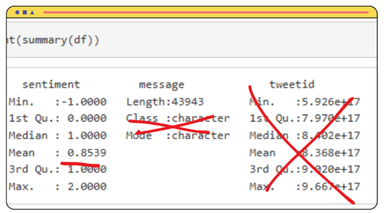
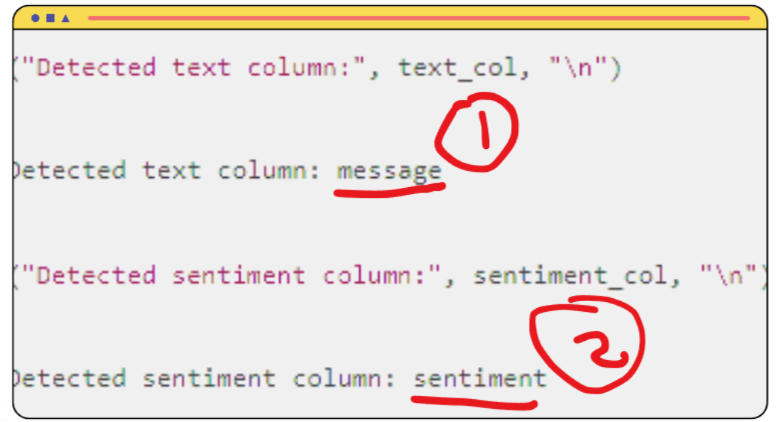
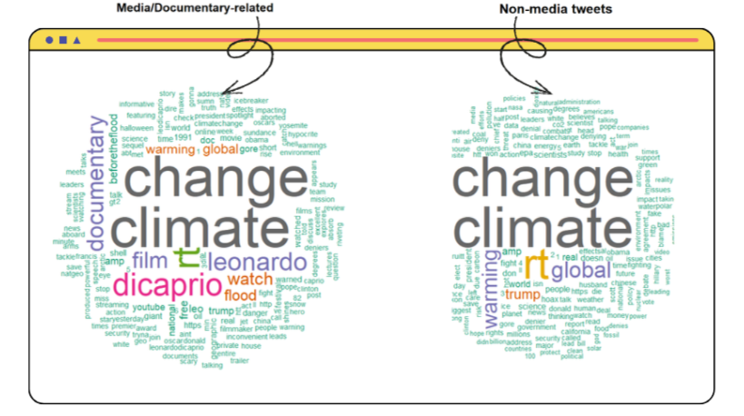
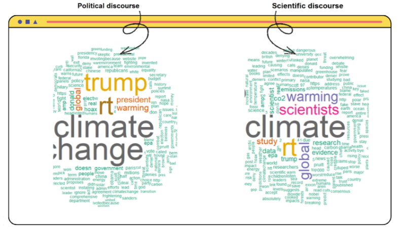
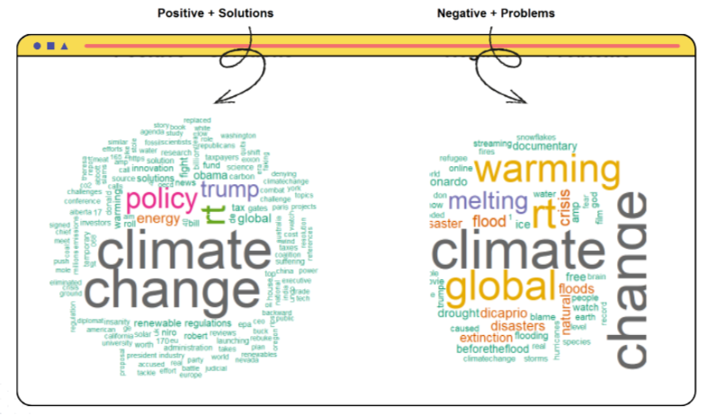

## Table of contents
[1. Introduction](#introduction) 
[2. Litearture Review](#litearture-review) 
[3. Methodology](#methodology) 
[4. Results](#results) 
[5. Conclusion](#conclusion) 

## Introduction
The earth's average temperature increases due to compression of gases in the atmosphere that trap the sun's heat. This is caused by human activities such as the use of motorized vehicles, burning fuel, deforestation and industrial activities. This causes the earth's temperature to continue to rise, the weather is unpredictable, and several aspects of human life are affected, including the environment, health and the economy.

Unstable climate change occurs due to global warming which disrupts weather patterns in various parts of the world. Irregular seasons, increasing intensity of natural disasters, and changes in various aspects of human life are the impacts of these changes.

Apart from that, the economic and tourism sectors are specifically particularly affected by global warming, especially in regions that depend on stable environmental conditions. Hurricanes and heat waves are examples of extreme weather that can damage infrastructure, disrupt agricultural production, and cause food prices to rise.

Changes in sea temperature is also having an impact on the fisheries sector, thereby affecting the fish ecosystem. Due to rising sea levels and reduced snowfall, natural destinations such as beaches and mountains are experiencing changes in the tourism sector.

Public discussion on climate change has also been increasing year by year. The relentless occurrence of extreme weather phenomena across the globe has already captured the attention of many. Social media, as a platform for disseminating public opinion, is favoured by many for its widespread reach and accessibility.Therefore, analysing social media commentary can help us understand current trends in public opinion and observe how climate change is perceived by the public.

__Research Question:__ What opinions and attitudes have been expressed by the public on social media regarding contemporary climate change over the past decade? And how might public sentiment on this issue evolve in the future?

## Litearture Review

Yale University conducted a quantitative study in the recent past. Large majorities in most surveyed countries say climate change is happening and is caused by humans. However, due to varying levels of awareness regarding individual and national responsibilities, acceptance of locally implemented climate change measures differs across nations. The majority express strong support for renewable energy expansion and climate policies, and nations and populations already experiencing the impacts of climate change demonstrate heightened focus and more urgent crisis response measures. 

On the other hand, almost all individuals concur that climate change constitutes an undeniable crisis, and acknowledge that within the foreseeable future, it holds the potential to inflict devastating consequences upon our planet. Some even contend that the primary cause of climate change lies entirely with human activity, encompassing excessive development, resource extraction, and ineffective policy formulation.

## Methodology

A dataset from __Kaggle__, entitled with __'twitter_sentiment_data.csv'__, is employed to conduct this research. This dataset comprises three columns: __'sentiment score”, 'message'__, and __'tweet_id'__. The entire dataset contains __43,943__ records, which recorded comments and messages releated to climate change from __Apr 2015 - Feb 2018__. All messages were labelled. 

Moreover, __R__ would be used in this research (of course!) , and sentiment analysis will be conducted in this research. Apart from the basic libraries such as __(ggplot2) / (tidyverse) / (lubridate)__,etc., specific libraries such as __(wordcloud) / (caret) / (e1071)__, etc., would be imported for word clouds generation and prediction based on the dataset. 

## Results

__Dataset Information__

As shown in the above graph, the avearge sentiment score for the whole dataset is __= 0.8539__. While the element of columns and 'tweet_id' are not important and useful in our dataset, the furthur research will ignore these results.

After data cleaning process, two colomuns are confirmed to be used for furthur research: __'message'__ and __'sentiment'.__ All results produced afterwards are all constructed based on data from these colomuns.

#

__Word Clouds__

All word clouds below contain common terms including __'climate', 'change', 'global' and 'rt' (realtime).__

Within the word cloud concerning media, we can observe that terms related to media __('film','documentary')__ and actors __('leonardo','dicaprio')__ are particularly prominent, reflecting how the media appears to play a particularly significant role in shaping public perceptions of climate change.

In the non-media classification section, terms such as __'trump', 'government'__,  and __'science'__ also frequently appear, reflecting widespread agreement that scientific progress and the views of political leaders play a decisive role in addressing climate change issues.

In light of this, further research into both politics and science is warranted. Analysis revealed that words such as __'scientists', 'study',__ and __'data'__ appeared with high frequency in the word cloud of scientific classifications. This reflects that when examining matters concerning climate change, people tend to require empirical evidence before they are persuaded.

On the other hand, within the political classification, terms such as 'trump', 'president', and 'Republican' reappeared. This may be linked to the previous radical statements and actions taken by US President Trump regarding climate change matters.

The study also analysed public attitudes towards climate change. Those holding positive views believe that promoting effective policies can break the current deadlock on climate change __('policy', 'solution', 'regulation')__. More pessimistic individuals contend that climate change may ultimately lead to unprecedented disasters on Earth __('flood', 'crisis', 'extinction')__.

#

__Sentiment Prediction__

Whilst presenting current public discourse through word clouds, the study also endeavours to construct a __Document-Term Matrix (DTM)__ based on the dataset. It further employs the __Naive Bayes algorithm__ to forecast potential future public opinions regarding climate change.

## Conclusion

Most people agree that climate change is occurring. The opinions and actions of powerful entities—such as national leaders and international organisations—exert a significant influence on climate change. The study analysed comments across four distinct dimensions, consistently revealing the public's high reliance on external sources of information (such as “website” in media discourse, “study” in scientific discourse, and “president” in political discourse). This demonstrates that for the public to comprehend the realities of climate change, the ability to discern misinfo rmation is particularly crucial.

In terms of prediction using sentiments, the model's figures (low accuracy) indicate that emotions prove difficult to serve as an effective predictive factor for gauging people's future stance on a given matter. Concurrently, the model exhibits a greater bias towards analysing messages with sentiment scores = 2, indicating that climate change-related messages supported by verifiable evidence enable more precise analysis of shifts in public awareness concerning climate change.

However, the study lacks geographical data pertaining to the publication of reviews (such as time and location), and some reviews exhibit repetitive arguments, potentially obscuring the situation from being as clear as it appears upon examination. Besides, as an open platform, social media is highly susceptible to the emergence of opinion-shaping or biased discourse. Personal factors such as commentators' backgrounds also prove difficult to systematise. It is recommended that future research should simultaneously compare different platforms or refine research designs through varied sampling methodologies.

