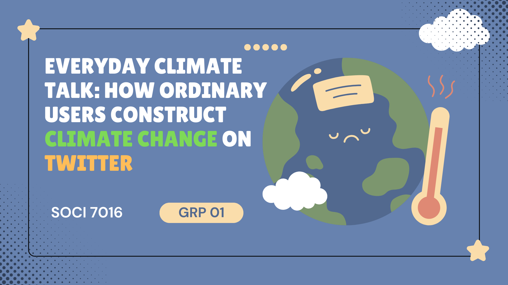
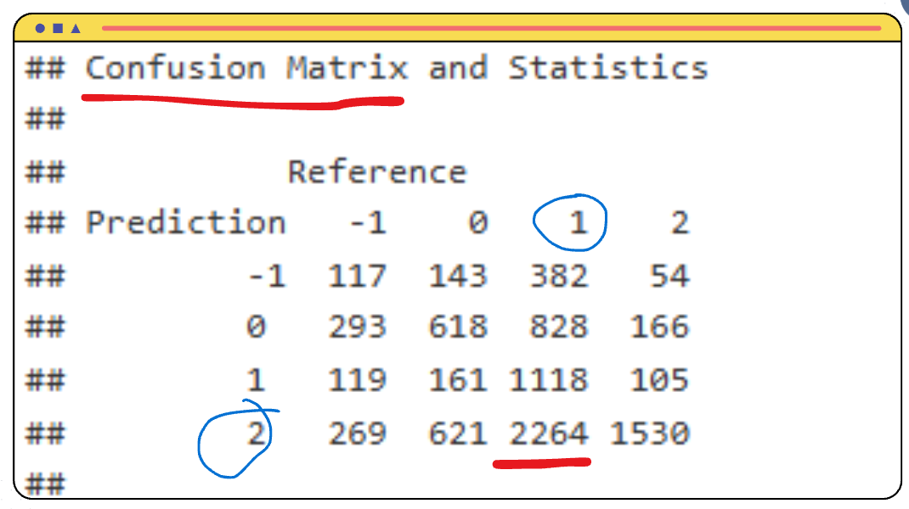
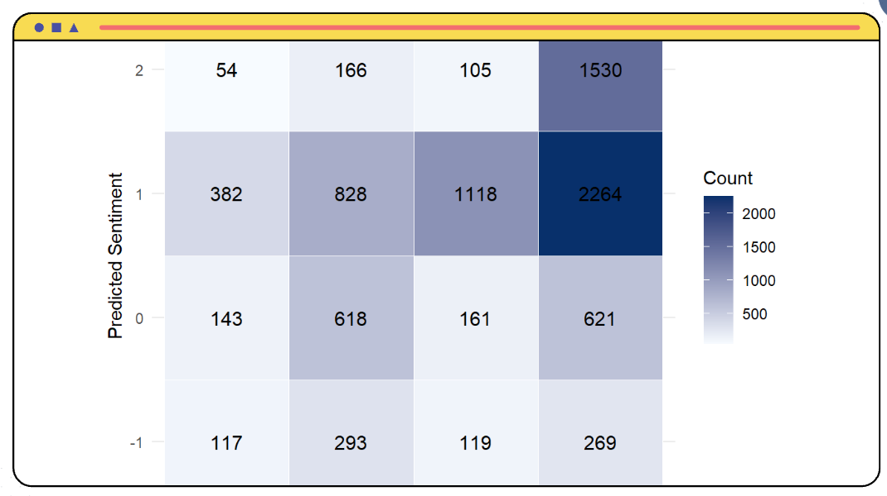
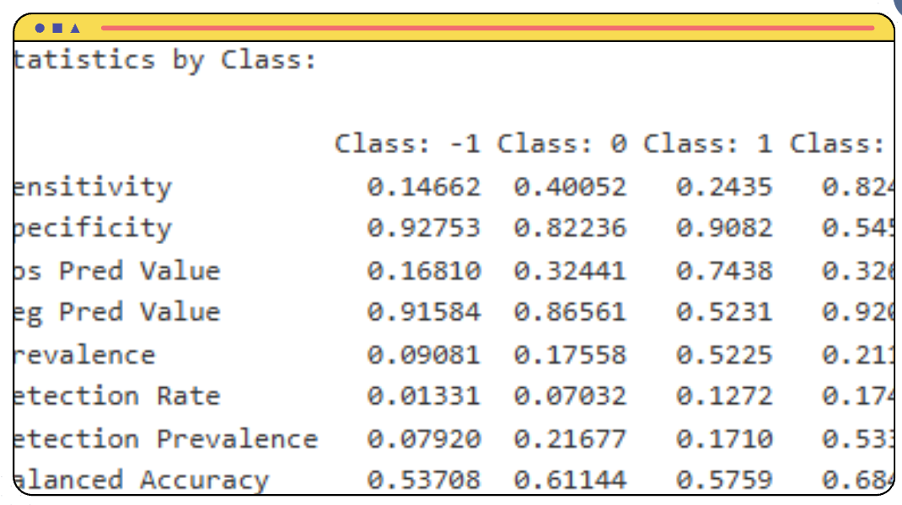

## Table of contents
[1. Introduction](#introduction) 

## Introduction
Forget think pieces that hand-wave about climate change.  
What happens when you actually read tens of thousands of real conversations about it?

That’s what this project set out to explore: nearly 44,000 climate-related tweets (2015–2018), pre-labelled with sentiment, analysed with R to understand how people talk about climate change, who they blame or trust, and how hopeful or hopeless they sound.

__What people talk about when they talk about climate change__

At the core of the dataset is a now-familiar story: most people accept that climate change is real, human-driven, and dangerous. But what’s interesting isn’t just whether they believe in it—it’s how they frame it, and who they see as responsible.

#

Scanning the tweets, several big themes stand out:

__- Everyday causes and global consequences__  
  People connect climate change to cars, fuel, deforestation, and industry—but also to floods, extreme weather, sea level rise, and ecosystem collapse. Climate change is framed less as a distant scientific problem and more as an ongoing global crisis touching health, livelihoods, tourism, and food systems.

__- Human-made crisis, human-made responsibility__  
Tweets consistently point the finger at overdevelopment, resource extraction, and weak or absent policy. The villains aren’t abstract “emissions” but governments, corporations, and political leaders who refuse to act.

#

__Four lenses of climate discourse__

Using word clouds across the dataset, you start to see four overlapping “worlds” of conversation:

__- Media & celebrity climate discourse__
Words like “film,” “documentary,” “leonardo,” “dicaprio” show just how strongly documentaries and celebrity advocates shape attention. Climate change here is seen through storytelling: big, emotional narratives, films, and viral clips driving awareness and urgency.

__- Non-media, everyday debate__
In more general conversations, terms like “trump,” “government,” “science” pop out. People talk about climate change by talking about leadership, facts, and public policy. It’s less “is climate change real?” and more “why is our government ignoring the science?”

__- Science as anchor__
Words such as “scientists,” “study,” “data” reveal an expectation that climate claims should be backed by evidence. People cite research, reports, and expert consensus. Science becomes a status marker: if you have “data” and “study” on your side, you’re seen as credible.

__- Politics as battleground__
The political word cloud is predictable but intense: “trump,” “president,” “republican”. Climate change is deeply politicised, entangled with party identity and presidential rhetoric. Many conversations are less about CO₂ and more about what political allegiance says about your stance on reality itself.

#

__Sentiment Prediction__

Whilst presenting current public discourse through word clouds, the study also endeavours to construct a __Document-Term Matrix (DTM)__ based on the dataset. It further employs the __Naive Bayes algorithm__ to forecast potential future public opinions regarding climate change. All data below will be rounded to three decimal places.

After creating the DTM via R, the model directly utilised it to perform Naive Bayes predictions. The results revealed that the prediction accuracy for sentiment = 1 (positive) was highest, at __0.523__.

The model simultaneously conducts a preliminary assessment of specific keywords within the word cloud, attempting to predict the impact of a given term on overall sentiment. Taking one of the most representative words as an example __(‘global’)__, we observe that this term carries a more negative connotation __(sentiment score = -1, 0.502 in the test set and -0.552 in the training set)__. The results reflect a considerable degree of concern among people regarding the current state of the planet.

We also employed the model to generate a confusion matrix. We observe that although sentiment scores 1 and 2 occasionally exhibit confusion __(2,264 true 2s predicted as 1)__, overall these two groups demonstrate the highest predictive accuracy and most faithfully represent the sentiment of the dataset. Conversely, the accuracy for negative and neutral __(-1, 0)__ scores is comparatively lower.

However, the final data reported by the model reveals that the accuracy of predictions based on sentiment analysis is relatively low. The overall accuracy is only __0.385 (test = 0.375, training = 0.395)__. On the other hand, the No information rate is as high as __0.523__, while the Kappa value __(0.183)__ and P-value __(~0)__ indicate limited reliability and performance. Concurrently, the predictive performance of Class 2 (sentiment value = 2) also surpassed that of the other three groups, indicating a bias within the predictive model.

## Conclusion

Most people agree that climate change is occurring. The opinions and actions of powerful entities—such as national leaders and international organisations—exert a significant influence on climate change. The study analysed comments across four distinct dimensions, consistently revealing the public's high reliance on external sources of information (such as “website” in media discourse, “study” in scientific discourse, and “president” in political discourse). This demonstrates that for the public to comprehend the realities of climate change, the ability to discern misinfo rmation is particularly crucial.

In terms of prediction using sentiments, the model's figures (low accuracy) indicate that emotions prove difficult to serve as an effective predictive factor for gauging people's future stance on a given matter. Concurrently, the model exhibits a greater bias towards analysing messages with sentiment scores = 2, indicating that climate change-related messages supported by verifiable evidence enable more precise analysis of shifts in public awareness concerning climate change.

However, the study lacks geographical data pertaining to the publication of reviews (such as time and location), and some reviews exhibit repetitive arguments, potentially obscuring the situation from being as clear as it appears upon examination. Besides, as an open platform, social media is highly susceptible to the emergence of opinion-shaping or biased discourse. Personal factors such as commentators' backgrounds also prove difficult to systematise. It is recommended that future research should simultaneously compare different platforms or refine research designs through varied sampling methodologies.

