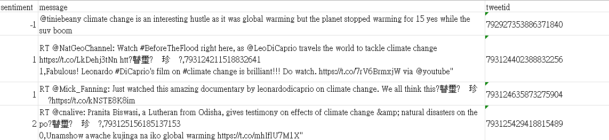
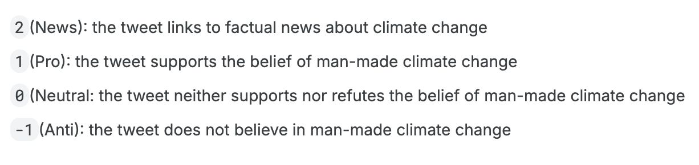
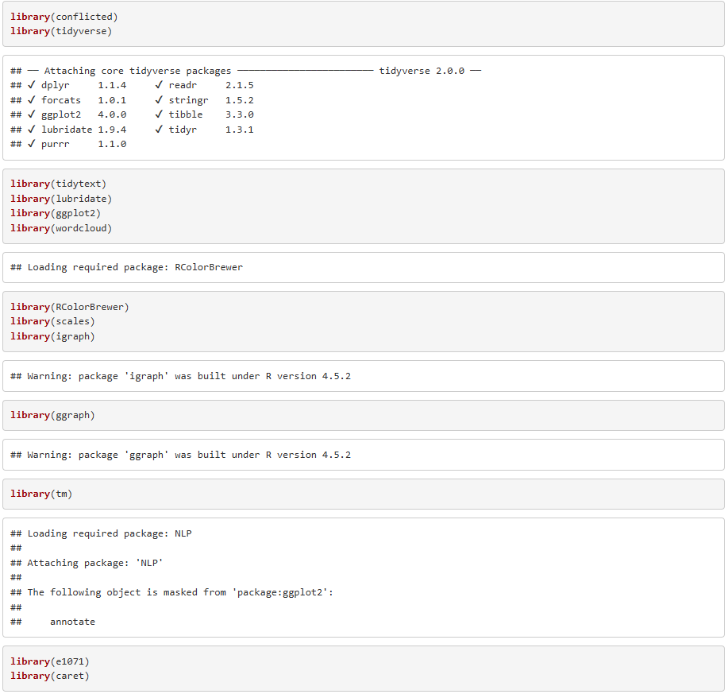

## Table of contents
[1. Introduction](#introduction) 
[2. Methodology](#methodology) 
[3. Results](#results) 
[4. Conclusion](#conclusion) 

## Introduction
The earth's average temperature increases due to compression of gases in the atmosphere that trap the sun's heat. This is caused by human activities such as the use of motorized vehicles, burning fuel, deforestation and industrial activities. This causes the earth's temperature to continue to rise, the weather is unpredictable, and several aspects of human life are affected, including the environment, health and the economy.

Unstable climate change occurs due to global warming which disrupts weather patterns in various parts of the world. Irregular seasons, increasing intensity of natural disasters, and changes in various aspects of human life are the impacts of these changes.

Apart from that, the economic and tourism sectors are specifically particularly affected by global warming, especially in regions that depend on stable environmental conditions. Hurricanes and heat waves are examples of extreme weather that can damage infrastructure, disrupt agricultural production, and cause food prices to rise.

Changes in sea temperature is also having an impact on the fisheries sector, thereby affecting the fish ecosystem. Due to rising sea levels and reduced snowfall, natural destinations such as beaches and mountains are experiencing changes in the tourism sector.

Public discussion on climate change has also been increasing year by year. The relentless occurrence of extreme weather phenomena across the globe has already captured the attention of many. Social media, as a platform for disseminating public opinion, is favoured by many for its widespread reach and accessibility.Therefore, analysing social media commentary can help us understand current trends in public opinion and observe how climate change is perceived by the public.

## Methodology

A dataset from Kaggle, entitled with “twitter_sentiment_data.csv”, is employed to conduct this research. This dataset comprises three columns: “sentiment score”, “message”, and “tweet_id”. The entire dataset contains 43,943 records, which recorded comments and messages releated to climate change from Apr 2015 - Feb 2018. All messages were labelled. 

Moreover, R would be used in this research (of course!) , and sentiment analysis will be conducted in this research. Apart from the basic libraries such as (ggplot2) / (tidyverse) / (lubridate)
, etc., specific libraries such as (wordcloud) / (caret) / (e1071), etc., would be imported for word clouds generation and prediction based on the dataset. 

## Results

## Conclusion

Most people agree that climate change is occurring. The opinions and actions of powerful entities—such as national leaders and international organisations—exert a significant influence on climate change. The study analysed comments across four distinct dimensions, consistently revealing the public's high reliance on external sources of information (such as “website” in media discourse, “study” in scientific discourse, and “president” in political discourse). This demonstrates that for the public to comprehend the realities of climate change, the ability to discern misinformation is particularly crucial.

In terms of prediction using sentiments, the model's figures (low accuracy) indicate that emotions prove difficult to serve as an effective predictive factor for gauging people's future stance on a given matter. Concurrently, the model exhibits a greater bias towards analysing messages with sentiment scores = 2, indicating that climate change-related messages supported by verifiable evidence enable more precise analysis of shifts in public awareness concerning climate change.

